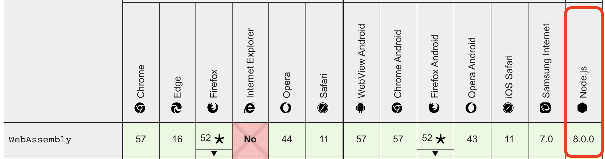

# wasm-golang

A quick example on compiling golang code to wasm to use in node/web applications.

How it works? You develop in golang using the [syscall/js](https://golang.org/pkg/syscall/js/) package to interact with WebAssembly host.

In the example created the code is pretty simple using 3 components:

* [main.go](./main.go)
* [main.js](./main.js)
* [wasm_exec.js)(./wasm_exec.js)

#### main.go

This is the golang code we'll compile to wasm and use in our node environment;

```
js.Global().Set("printMessage", js.FuncOf(printMessage))
```

This injects into node environment `global` object a function called `printMessage` so its callable from our node application

golang code can be compiled to wasm with

```
GOOS=js GOARCH=wasm go build -o main.wasm main.go
```

#### main.js

Is the wrapper to interact with the compiled wasm file using `wasm_exec.js`

#### wasm_exec.js

wasm_exec.js is the official Golang runtime wrapper provided by the language

```
ls "$(go env GOROOT)/misc/wasm"
```

[Source code](https://github.com/golang/go/blob/master/misc/wasm/wasm_exec.js)

For easier setup we copied the wasm_exec.js wrapper to the project itself. 

### Setup

```
npm ci
```

### Development

```
npm run wasm:build
npm run bridge
```

#### Test

```
npm run test:unit
```

## Resources

* [https://golang.org/pkg/syscall/js/](https://golang.org/pkg/syscall/js/)
* [https://www.aaron-powell.com/posts/2019-02-06-golang-wasm-3-interacting-with-js-from-go/](https://www.aaron-powell.com/posts/2019-02-06-golang-wasm-3-interacting-with-js-from-go/)

## Disclaimer

**⚠ Not working on node7.6, WebAssembly supports starts in node8**


